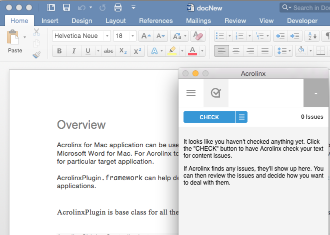
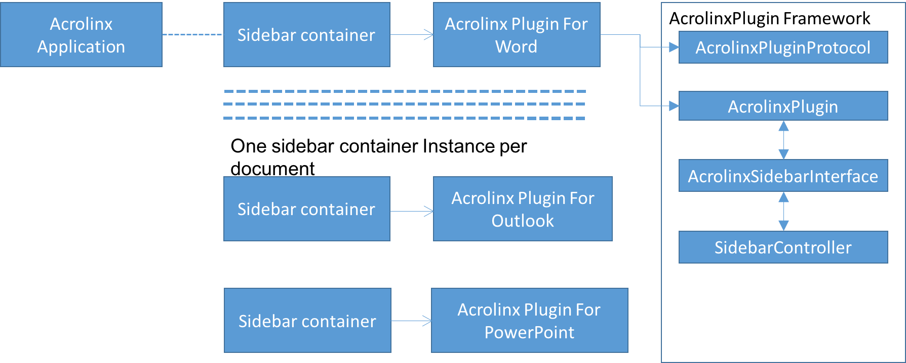
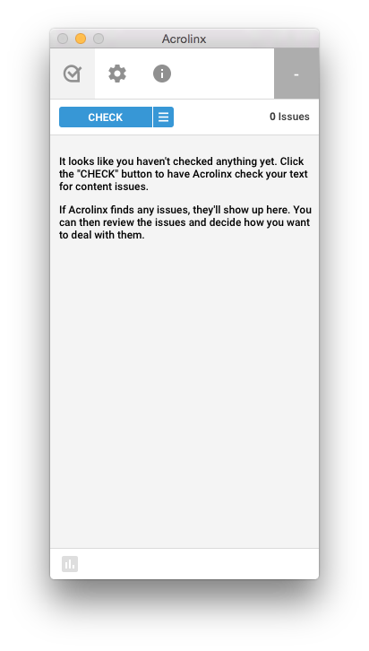
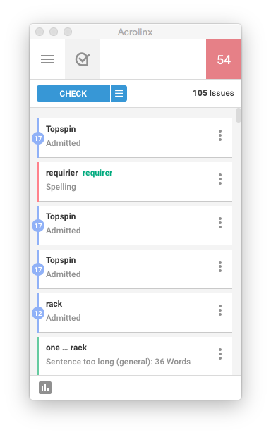
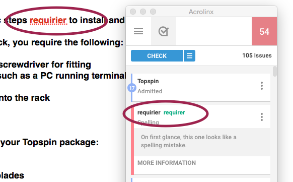

#Acrolinx OS X Sidebar Demo  

##Introduction

Demo code is to showcase [Acrolinx](http://www.acrolinx.com/) sidebar integration for a Mac OS X Application. To understand the demo code an introduction to Acrolinx Sidebar, Acrolinx Application for Mac and Acrolinx Plugin Framework and is required. 

###Acrolinx Sidebar
The Acrolinx sidebar is designed to show up beside the window where you edit your content. You use it for checking, reviewing, and correcting your content.



###Acrolinx Application for Mac
Acrolinx Applicaiton for Mac helps you open a sidebar for a document open in an editor application like MS Word for Mac. Acrolinx application can show sidebar for only those applications for which it finds an Acrolinx plugin installed. 



###Acrolinx Plugin Framework  
`AcrolinxPlugin.framework` helps develop Acrolinx plugin for different applications. The framework is available with this sample code in folder `AcrolinxPluginSDKForMac`

##Sample - Acrolinx Plugin for TextEdit


The sample shows how to use `AcrolinxPlugin.framework` for creating an acrolinx plugin for TextEdit application.

##Prerequisite

Please contact Acrolinx SDK support (sdk-support@acrolinx.com) for consulting and getting your integration certified. This sample works with a test license on an internal acrolinx server. This license is only meant for demonstration and developing purposes. Once you finished your integration you'll have to get a license for your integration from Acrolinx.

To build and run the sample you need the following:

* Acrolinx application (min version 1.4.0.613)
* Test server credentials

For writing new plugin you also need:

* AcrolinxPlugin.framework. 


##Configuration for Sample Plugin

The Acrolinx Server checks if a connecting client is allowed to connect. To enable this the sample code includes a valid client signature. To enter new client signature in the code open `AcrolinxPluginTextEdit.xcodeproject`. Navigate to `AcrolinxPluginTextEdit.m`,  Find method `clientSignature` and edit the value to return the client signature you obtained from Acrolinx. 


##Build and Run Sample Plugin


Following are the steps to build and run the sample plugin. 

* Open AcrolinxPluginTextEdit.xcodeproject and build the project in Xcode.
* Put the output file AcrolinxPluginTextEdit.acpl to user’s PlugIns folder `(“~/Library/Application Support/PluginIns”)`
* Run Acrolinx application. 
* In preferences give valid Acrolinx server URL.


* Open a TextEdit document, new documents must be saved once for the Acrolinx Plugin to identify it. 
* Optionally you can open the sample document topspin.txt. It can be found in "acrolinx-sidebar-demo-osx/doc" folder. 
* While TextEdit is the active application go to Acrolinx menu and select “Show Sidebar”. "Show Sidebar" menu is enabled only if the file extension is .txt or .rtf


* It would open a sidebar. Provide server credentials to log in. 




* When sidebar is loaded run a check.



* Clicking a card in sidebar highlights corresponding text in the document. 


* Clicking on the suggestion replaces the text in document. 

Note if the document has been changed manually then the check must be run again for highlight and replace to work properly. 

#Writing new Acrolinx Sidebar Plugin

##Prerequisite

For writing Acrolinx plugin for  an application you need:

* Acrolinx application (min version 1.4.0.613)
* Test server credentials
* Client signature
* AcrolinxPlugin.framework. The framework is available with this sample code in folder `AcrolinxPluginSDKForMac`.

You should also know:

* The bundle identifier of the application for which Acrolinx Plugin is to be written. Bundle identifier can be found in the info.plist file inside the application's bundle.
* Way to find list of open documents and identifying active document. Acrolinx application creates sidebar for particular document. The plugin should keep track of the document it is associated with.
* Way to extract document content.
* Way to highlight and replace text in given range.

##Plugin Project Setup

* Create an Xcode project of type Bundle.
* Create new Cocoa class file. Set Principal Class in project info.plist to the given class name.
* In project build setting add `AcrolinxPlugin.framework` location in Frame Search Path.
* For Acrolinx application to identify and load the plugin the principal plugin class should be derived from the class `AcrolinxPlugin`. It should also implement protocols `AcrolinxPluginProtocol` and `AcrolinxSidebarDelegate`.


##Plugin Identification

* When Acrolinx application is launched it loads all supported plugins from location “~/Library/Application Support/PluginIns”. 
* Supported plugin would mean a plugin bundle whose principal
class `isSubclassOfClass` `AcrolinxPlugin` also it `conformsToProtocol` `AcrolinxPluginProtocol` and `AcrolinxSidebarDelegate`.

##Sidebar Loading

* Acrolinx application continuously checks if it has a plugin for currently active application. 
* It queries the appropriate plugin for `frontmostFilePath` of the documents open in target application. 
* File extension of the frontmost file path also plays a role in enabling "Show Sidebar" menu. The extension should be part of `supportedExtensions` list of one of the loaded plugins. 
* When user selects "Show Sidebar" Acrolinx does performs few steps including: 
	* Creating appropriate plugin object
	* Instantiating the `AcrolinxSidebarController` and set the plugin object its delegate.
	* Calling `openFileAtPath` method, here plugin should save the file path for future reference to own file path.
	* Calling `loadSidebarURL`. The plugin should pass the sidebar URL to the `sidebarController` for loading.
*  For initializing sidebar the plugin should implement `AcrolinxSidebarDelegate` method `sidebarLoaded`.
*  Typical implementation of `sidebarLoaded` looks like this:
  

```
 #pragma mark - AcrolinxSidebarDelegate
 - (void)sidebarLoaded {
    
    NSMutableDictionary *sidebarOptions = [self createSidebarOptionsForPlugin];
    
    // Parameter to make the sidebar readonly.
    //[sidebarOptions setValue:@"true" forKey:@"readOnlySuggestions"];
    
    [[[self sidebarController] JSInterface] initializeSidebarWithOptions:sidebarOptions];
}
```    

* The framework provides method to create the sidebar options needed for initializing the sidebar. The options include necessary version information and client signature etc. Plugin can add more options keys like "readOnlySuggestions" is needed.

## Extraction and Lookup

###Extraction 

* When user presses "Check" button in the sidebar the `AcrolinxSidebarInterface` gets a request to initiate check. 
* The plugin's principal class must implement `AcrolinxPluginProtocol` method `startGlobalCheck`. 
* Here plugin is expected to extract the content of associated file and handover the extracted content to the  `AcrolinxSidebarInterface` instance. 
```
[[[self sidebarController] JSInterface] performGlobalCheck:stringExtractedFromEditor];
``` 

###Lookup

* Plugin's principal class should implement `AcrolinxSidebarDelegate` methods `sidebarDidSelectWithMatches` and `sidebarDidReplaceWithReplacements`.
* When user selects cards in sidebar for highlighting or replacement these methods are called accordingly. 
* Parameter is an array of dictionaries which hold content, range and replacements. 
* The offsets correspond to the cotent sent to the server. 
* The plugin should map these ranges to actual ranges in the document and interact with editor to perform highlight or replacement operation.

##Framework Reference
Refer doc/com.acrolinx.AcrolinxPlugin-Framework.docset for the class reference.


## License

Copyright 2015-2016 Acrolinx GmbH

Licensed under the Apache License, Version 2.0 (the "License");
you may not use this file except in compliance with the License.
You may obtain a copy of the License at

http://www.apache.org/licenses/LICENSE-2.0

Unless required by applicable law or agreed to in writing, software
distributed under the License is distributed on an "AS IS" BASIS,
WITHOUT WARRANTIES OR CONDITIONS OF ANY KIND, either express or implied.
See the License for the specific language governing permissions and
limitations under the License.

For more information visit: http://www.acrolinx.com

