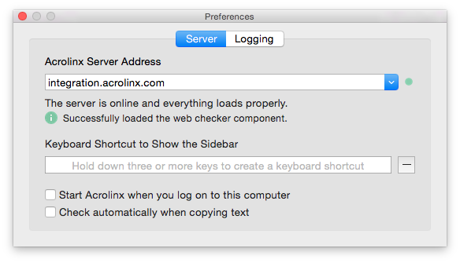
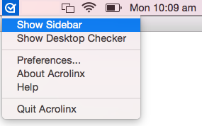

#Acrolinx OS X Sidebar Demo  

##Acrolinx Plugin Framework 

Acrolinx for Mac application can be used to check content of document open in an editor like Microsoft Word for Mac. For Acrolinx to be able to check it requires an Acrolinx Plugin written for particular target application. 

`AcrolinxPlugin.framework` helps develop Acrolinx plugin for different target applications. 

##Sample - Acrolinx Plugin for TextEdit

The sample shows how to use `AcrolinxPlugin.framework` for creating an acrolinx plugin for TextEdit application.

##Prerequisite

To build and run the sample you need the following:

* Acrolinx application (min version 1.4.0.613)
* Test server credentials
* Client signature(explained in “Configuration for Sample Plugin” section)

For writing new plugin you also need:

* AcrolinxPlugin.framework.

##Configuration for Sample Plugin

The Acrolinx Server checks if a connecting client is allowed to connect. To enable this you must provide a valid client signature. First obtain a client signature from Acrolinx. To enter new client signature in the code open `AcrolinxPluginTextEdit.xcodeproject`. Navigate to `AcrolinxPluginTextEdit.m`,  Find method `clientSignature` and edit the value to return the client signature you obtained from Acrolinx. 

##Build and Run Sample Plugin

Following are the steps to build and run the sample plugin. 

* Open AcrolinxPluginTextEdit.xcodeproject and build the project in Xcode.
* Put the output file AcrolinxPluginTextEdit.acpl to user’s PlugIns folder `(“~/Users/persistent/Library/Application Support/PluginIns”)`
* Run Acrolinx application. 
* In preferences give valid Acrolinx server URL.

* Open a TextEdit document, new documents must be saved once for the Acrolinx Plugin to identify it. 
* While TextEdit is the active application go to Acrolinx menu and select “Show Sidebar”. "Show Sidebar" menu is enabled only if the file extension is .txt or .rtf

* It would open a sidebar. Provide server credentials to login. 

* When sidebar is loaded run a check.

## License

Copyright 2015-2016 Acrolinx GmbH

Licensed under the Apache License, Version 2.0 (the "License");
you may not use this file except in compliance with the License.
You may obtain a copy of the License at

http://www.apache.org/licenses/LICENSE-2.0

Unless required by applicable law or agreed to in writing, software
distributed under the License is distributed on an "AS IS" BASIS,
WITHOUT WARRANTIES OR CONDITIONS OF ANY KIND, either express or implied.
See the License for the specific language governing permissions and
limitations under the License.

For more information visit: http://www.acrolinx.com

